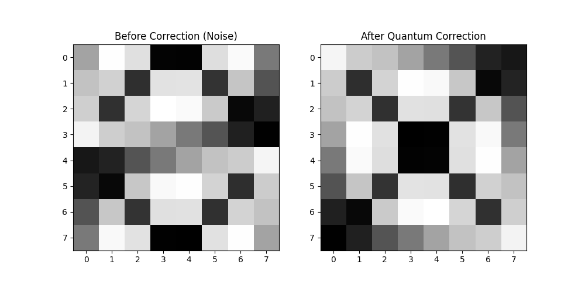

# Distributed Quantum Image Teleportation

This project was developed as a team project for the college micro course "Quantum Technologies". It implements a functional simulation of a distributed quantum network designed to securely teleport small-scale images between two independent nodes using Quantum Probability Image Encoding (QPIE).

## The Cause: What We Try to Tackle

Modern data transmission relies on classical networks where information is vulnerable to copying, sniffing, and unauthorized interception. While quantum technologies offer theoretical solutions to these problems, practical implementations face two major hurdles:

1. **The Qubit Bottleneck:** Traditional methods of encoding images into quantum states, such as Flexible Representation of Quantum Images (FRQI) or Novel Enhanced Quantum Representation (NEQR), require a large number of qubits. This makes them impossible to simulate on standard classical hardware or run on current Noisy Intermediate-Scale Quantum (NISQ) processors.
2. **The Simulation Gap:** Most quantum simulations are written as static Python scripts or Jupyter Notebooks. They run in a single environment where the "sender" and "receiver" share the same local variables, failing to capture the physical reality of a distributed network where nodes are physically separated and communication must happen over classical and quantum channels.

We built this project to bridge this gap by simulating a real-time, distributed system that teleports compressed image data across two separate nodes using minimal quantum resources.

## What We Did and Why

We developed a web-based, role-separated quantum teleportation pipeline. The system uses a 16x16 image container, which we chose because it balances visual clarity with the computational limits of real-time classical simulation.

### 1. Quantum Probability Image Encoding (QPIE)
To solve the qubit bottleneck, we implemented QPIE. Instead of using a qubit for every pixel, QPIE encodes the normalized grayscale values of the image directly into the probability amplitudes of the quantum state. 
* **Why:** This approach achieves exponential compression. A 16x16 image containing 256 pixels is encoded using only 8 qubits ($2^8 = 256$). Simulating the full 3-qubit teleportation circuit per pixel channel requires a total of 24 qubits, which runs stably on consumer laptops without running out of memory.

### 2. Distributed Architecture (Flask & SocketIO)
Instead of a static script, we built a web interface that separates the roles of the two parties:
* **Sender:** Uploads an image, which is instantly encoded into a statevector. The act of measuring the system collapses the state and destroys the original image on the sender's screen, adhering to the laws of quantum mechanics.
* **Receiver:** Receives the scrambled quantum state vector (which looks like random noise) and the classical correction key.
* **Why:** This structure simulates a true physical network where the quantum state and the classical key travel separately.

### 3. Double Entanglement and Entanglement Swapping
The quantum bridge uses a more advanced protocol than standard single-pair teleportation. Instead of creating one Bell pair, the system creates **two independent EPR (Einstein-Podolsky-Rosen) pairs**:
* **EPR Pair 1:** Entangles the sender's bridge qubit with an intermediate node qubit.
* **EPR Pair 2:** Entangles the intermediate node qubit with the receiver's qubit.

The intermediate node then performs a **Bell State Measurement (BSM)** on its two qubits (one from each pair), which destroys the local entanglement and **transfers (swaps)** the entanglement directly between the sender and the receiver. After the swap, the sender and receiver share an entangled state even though they were never directly connected.
* **Why:** This Entanglement Swapping protocol is the foundation of how a real **Quantum Repeater** works and is the core mechanism for long-distance quantum communication in a Quantum Internet. It allows quantum information to travel through intermediate nodes without ever being "read" by those nodes.

### 4. Strict "No-Cheating" Verification
We removed all shortcuts from the network payload. The server does not send the original or restored image to the receiver. 
* **Why:** To prove the security of the protocol. The receiver's browser receives only the scrambled noise. The browser must run local JavaScript math to apply the Pauli-X and Pauli-Z corrections using the classical key to reconstruct the image. Without the key, the image remains mathematically unreadable, demonstrating the "Blind Receiver" security model.

## Simulation Results

Below is the output demonstrating the quantum image reconstruction. The left side shows the scrambled state vector (received as noise), and the right side shows the successfully reconstructed image after applying the classical correction key.

## Practical Applications for a 16x16 Grid

Because our system is optimized for low-resolution, high-value data, it can be applied to several real-world scenarios without needing to scale up the qubit count:

* **Quantum QR Authentication:** Standard Micro QR codes (11x11 or 13x13) can be padded into our 16x16 grid. Teleporting these codes creates a one-time-use digital key. Since the state collapses upon measurement, the key cannot be screenshotted or cloned.
* **Biometric Minutiae Mapping:** Rather than transmitting complete fingerprint files, security systems map critical coordinates (minutiae points). Our 16x16 grid is ideal for sending these coordinate maps securely, ensuring biometric data is verified and immediately destroyed without being stored on hackable databases.
* **One-Time-Password (OTP) Bitmaps:** Teleporting OTPs as 16x16 binary images instead of plain text protects financial transactions. An eavesdropper on the classical network only intercepts the correction key, which is useless without access to the physical quantum receiver node.
* **Molecular Fingerprinting:** In pharmaceutical research, a 16x16 adjacency matrix can represent the atomic bonds of a chemical compound. Labs can teleport these matrices to check if they are working on the same molecule without sharing the actual chemical formula, protecting valuable intellectual property.

## Future Scope

* **Integration with Physical Hardware:** Transitioning the backend from the local Qiskit statevector simulator to actual physical quantum processors using IBM Quantum Runtime.
* **Noise and Error Mitigation:** Implementing error mitigation algorithms to preserve image fidelity when executing the 24-qubit circuit on noisy, real-world NISQ devices.
* **Parallel Tiling for Higher Resolutions:** Developing a segmentation pipeline that breaks larger images (such as medical scans) into independent 16x16 blocks, teleporting them in parallel, and reassembling them at the destination node.
